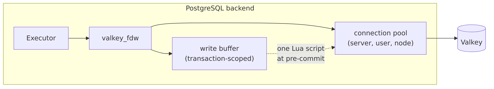
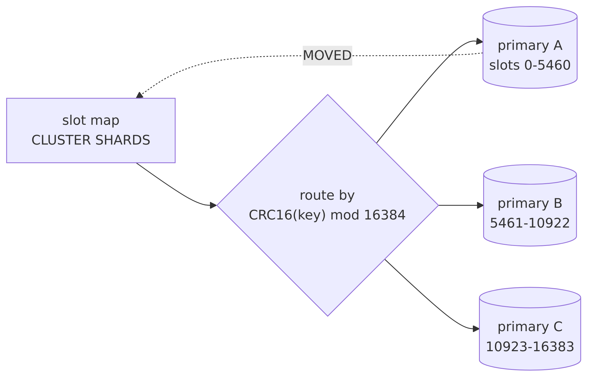

# valkey_fdw

A PostgreSQL foreign data wrapper for [Valkey](https://valkey.io/).

It maps Valkey keys onto SQL tables with typed, per-field columns, pushes key
lookups down to the server, and treats writes as part of the PostgreSQL
transaction they belong to.

Independent implementation, sharing no code with any other key-value wrapper.
Its acceptance checklist is a defect ledger rather than a feature list: each
known failure mode of a wrapper of this kind is either unreachable here by
construction or pinned by a test that names it.

```sql
CREATE EXTENSION valkey_fdw;

CREATE SERVER cache FOREIGN DATA WRAPPER valkey_fdw
    OPTIONS (host 'valkey.internal', port '6379', tls 'true');
CREATE USER MAPPING FOR CURRENT_USER SERVER cache
    OPTIONS (password 'secret');

CREATE FOREIGN TABLE sessions (
    id      text OPTIONS (key   'true'),
    user_id text OPTIONS (field 'user'),
    expires text OPTIONS (field 'exp')
) SERVER cache OPTIONS (tabletype 'hash', keyprefix 'sess:');

SELECT user_id FROM sessions WHERE id = 'sess:abc';   -- one HGETALL
```

## Status

**Version 0.1, and there has been no release.** Reads and writes work,
including against a cluster. Vector search does not.

| Area | State |
|---|---|
| Table types | `string`, `hash`, `list`, `set`, `zset` |
| Discovery | keyspace scan, `keyprefix`, `keyset` index, `singleton_key` |
| Pushdown | `key = 'literal'` answered with a single fetch; `ANALYZE` estimates |
| Writes | `INSERT`, `UPDATE`, `DELETE`, `COPY FROM` — one atomic unit per transaction |
| Transport | TLS with hostname verification, ACL auth, RESP3 with a tested RESP2 fallback |
| Cluster | slot discovery, per-node pooling, fan-out scans, `MOVED`/`ASK`, single-slot writes |
| Accepted, then refused | `legacy_value 'true'`, `ttl` columns and `distance` columns. The validator takes all three so a table can be defined ahead of the feature; the first query against such a table raises `0A000` |
| Declared, not routed | `prefer_replica` marks a server a replica and refuses writes through it. It sends no read anywhere else |

Three qualifications, stated once here rather than repeated below.

**It has not been through a release cycle.** The option names, the SQLSTATEs
and the shapes a table may take are settled enough to document and to build
against, and the suites hold them still from one build to the next. They have
not yet had to hold still for anyone else. An option that turns out to be the
wrong idea will be changed rather than carried for compatibility with a version
nobody ran.

**A shape in the *accepted, then refused* row is a definition you may write and
a query you may not run.** `search_index` and `index_type` stop one step short
of that: they are accepted, they raise nothing, and nothing consults them — no
qual reaches the index, and a table carrying one cannot be written. Between
those two and a refused `distance` column, vector similarity search is absent
rather than partial. No date is attached to it or to the other two.

**Every claim of working behaviour above is a suite rather than a sentence.**
`harness.sh ci` runs those suites across three PostgreSQL majors, two Valkey
versions and six topologies. The exception is the benchmark numbers further
down, which are a measurement of one container and say so where they appear.

## How it works

Three ideas carry most of the design: **one pooled connection per identity**,
**values fetched in pipelined batches**, and **writes deferred to a single
atomic script at commit**.



<!-- Diagram source: img/overview.mmd. Regenerate with ./scripts/diagrams.sh -->

### The read path

A scan discovers keys, then fetches their values in batches rather than one
round trip per key. That batching is the single largest performance
difference from a per-key client: a page of values costs one flush rather than
one round trip each, so network latency is paid per page instead of per row
(see *Performance* below).


<!-- Diagram source: img/read-path.mmd. Regenerate with ./scripts/diagrams.sh -->

**A scan can return the same key twice, and this wrapper does not remove the
second one.** `SCAN`'s contract is that a key present for the whole traversal
is returned *at least* once, not exactly once: the cursor is a position in the
server's own hash table rather than a snapshot of the keyspace, so a keyspace
that grows or empties enough for the server to resize that table while the
cursor is open can hand back a key it has already handed back. A scan keeps no
set of the keys it has emitted, so what arrives twice is **two identical rows**
— same key, same values.

This is what `SCAN` is, rather than a deficiency being worked on. Filtering it
here would mean a per-scan set of every key seen, unbounded in the size of the
keyspace, to correct something a query can say for itself with `SELECT
DISTINCT` or a `GROUP BY`. A `keyset` table traverses its set with `SSCAN` and
has the same property. The reads that never traverse cannot duplicate at all:
`WHERE key = 'literal'` is a single fetch, and a `singleton_key` table is one
key.

### The write path

Writes are **not** sent as they execute. They accumulate in a transaction-scoped
buffer, are folded into a per-key plan, and are applied by one Lua program at
pre-commit — so Valkey either applies all of a transaction or none of it.
`ROLLBACK` sends nothing at all.


<!-- Diagram source: img/write-path.mmd. Regenerate with ./scripts/diagrams.sh -->

The preconditions are what make a concurrent writer lose at its own `COMMIT`
rather than silently overwrite: the script checks what it expected to find
before it changes anything.

### On a cluster

`SCAN` is per node, so a scan visits every primary in turn — **an exhausted
node is not an exhausted scan.** Writes must fit in one hash slot, because one
Lua script cannot span slots.



<!-- Diagram source: img/cluster.mmd. Regenerate with ./scripts/diagrams.sh -->

A transaction whose keys span slots is **refused whole** with `0A000` rather
than split across nodes, because splitting would make partial application an
ordinary outcome. Hash tags are the way out — `{tenant}:orders` and
`{tenant}:items` share a slot by construction.

## Performance

Two mechanisms account for most of the difference between this and a client
that talks to Valkey a key at a time, and both are asserted by the suites
rather than described here and taken on trust.

**Values are fetched in batches.** A scan discovers keys a page at a time and
then fetches a whole page of values in one pipelined batch, so N values cost
`ceil(N / pipeline_batch)` flushes rather than N round trips. That arithmetic
is the wrapper's own rather than the server's, so `io.sql` pins it as exact
numbers: 500 commands at a `pipeline_batch` of 7 is 71 flushes, and at the
default 256 it is 1. The consequence is that a scan's cost tracks the number of
pages rather than the number of rows, and every millisecond of network latency
is paid once per flush instead of once per key.

**Connections are opened once per identity.** The pool is keyed by
`(server, user)` and its entries outlive statements and transactions, so no
statement pays for a connect, an `AUTH` and a `SELECT` of its own. `pool.sql`
asserts the counts directly: `opened_total` stays at 1 across repeated
statements, and a second connection appears only when two scans genuinely read
at once.

Neither claim carries a timing figure, because neither needs one: both are
round-trip arithmetic, which is a property of the design rather than of the
machine it ran on, and both are checked on every build.

Timings do appear further down, under *Benchmarks*, and they are what
`harness.sh bench` prints on the machine you run it on. Read them as that and
nothing more - one container against one server says what that pair did, and
carries no claim about yours.

## Internals

`INTERNALS.md` documents how the wrapper works and why it is shaped the way it
is: the layering and what each layer may depend on, the invariants and where
each is enforced, the read and write paths function by function, and the
documentation drift a full read of the source turned up. It is the place to
start before changing anything below the option table.

## Testing

Everything builds and runs in containers; nothing is built on the host.

```bash
./scripts/harness.sh images --pg 17     # build the toolchain image
./scripts/harness.sh test --pg 17       # the default topology
./scripts/harness.sh test --pg 17 --topology cluster
```

The suites drive entry points that reach a Valkey server without going
through a foreign table, and those live in a second extension:

```sql
CREATE EXTENSION valkey_fdw;
CREATE EXTENSION valkey_fdw_test;   -- diagnostics; superuser only, never needed in production
```

`harness.sh` loads both. An installation that will never run a suite should
create only the first — that is what keeps a diagnostic which dials an
arbitrary host and port out of a production catalogue.

| Target | What it covers |
|---|---|
| `test` | 16 suites on the default topology, plus the TAP tests; 9 more suites across `tls`, `acl`, `fault`, `cluster`, `search` |
| `tap` | the TAP tests alone — a query cancelled from another session. Part of a full `test` on the default topology; this runs them by themselves |
| `isolation` | two concurrent writers — who wins, and what the loser sees. Not part of `test` |
| `test --cassert` | the whole suite under `CLOBBER_FREED_MEMORY` and `MEMORY_CONTEXT_CHECKING` |
| `test --vendored` | linked against a pinned static libvalkey instead of the system one |
| `mutate` | re-runs the defect behind each closed register entry and requires the suite to go red |
| `bench` | flush latency and overlay scan cost |
| `lint` | file and function size limits, banned constructs |

The diagrams above are generated, not drawn: `img/*.mmd` are the sources and
`./scripts/diagrams.sh` renders them. `--check` re-renders into a scratch
directory and fails if a committed PNG no longer matches its source, which is
what CI runs.

All of it on PostgreSQL 16, 17 and 18.

`mutate` is the unusual one and the most load-bearing. A test that has quietly
stopped asserting looks exactly like a test that passes, so each closed defect
keeps the one-line edit that used to reproduce it; a mutation that leaves the
suite green is reported as a failure of the check, not a success of the code.

## Bulk loading

`COPY FROM` buffers the whole transaction in memory and applies it as one
unit, so a single `COPY` of a very large file is bounded by `write_max_ops`
(10000 by default) and `write_max_bytes` (64 MB), and will be refused with
`54000` rather than partially applied. Chunk large loads into transactions:

```sql
-- one transaction per chunk; each is atomic on its own
BEGIN; COPY t FROM '/path/chunk-001.csv' (FORMAT csv); COMMIT;
BEGIN; COPY t FROM '/path/chunk-002.csv' (FORMAT csv); COMMIT;
```

Raising the caps instead trades the refusal for backend memory and for a
longer single script execution — and that is not a throughput question. Valkey
is single threaded and `EVAL` is not preemptible, so a flush holds the whole
server for its duration. Past `busy-reply-threshold` (5000 ms by default)
every other client gets `BUSY`. Worse, **a script that has already written
cannot be killed**: `SCRIPT KILL` refuses once a write has happened, so the
only way out is `SHUTDOWN NOSAVE`. The caps are a blast radius, not a
performance knob.

Measured (`harness.sh bench`, one container, small rows, Valkey 9.0.5):

| Rows | Commit | Per row |
|---|---|---|
| 1 000 | 30 ms | 30 µs |
| 10 000 (default) | 265 ms | 27 µs |
| 25 000 | 776 ms | 31 µs |
| 50 000 | 1 472 ms | 29 µs |

Value size dominates at a fixed row count — 10 000 rows takes 214 ms at
100-byte values and 1 182 ms at 10 KB — but 10 KB × 10 000 is 100 MB, so
`write_max_bytes` refuses first. That is the two caps working together:
whichever binds first keeps the flush bounded either way. At the defaults the
worst case is roughly **0.3–1 s**, leaving a 5–15× margin below the threshold.

That margin is what you spend when you raise a cap, and the numbers above are
from an idle container. A loaded production server is slower, so measure on
yours rather than scaling these.

## Durability boundary

The promise is one-directional: **committed in PostgreSQL implies accepted by
Valkey.** The converse does not hold, and the gaps below are properties of
Valkey and of PostgreSQL's commit sequence rather than things a future release
will quietly fix.

1. **PostgreSQL can abort after a completely successful flush.** `PRE_COMMIT`
   is not the last thing that can fail — `AfterTriggerEndXact`,
   `PreCommit_Notify` and `PreCommit_CheckForSerializationFailure` all run
   after it, as does any extension callback registered before ours. Under
   `SERIALIZABLE`, a transaction that writes Valkey and then loses a
   read-write conflict applies its writes and then aborts. Because every
   operation carries a precondition, a retry usually fails with `23505` or
   `40001` rather than duplicating — **except a list `INSERT`, which has no
   absence precondition and will duplicate.** Valkey has no two-phase commit
   and no rollback; this window cannot be closed.
2. **A connection lost, a cancel or a timeout after the program reached the
   socket leaves the outcome unknown.** Reported as
   `08007 transaction_resolution_unknown` where we raise it ourselves, and as
   an added context line otherwise. The message says the write may or may not
   have been applied, because that is the truth.
3. **Partial application is possible**, though by no route we know how to
   reach: an ACL change landing mid-script, or a bug in our own check set.
   Reported at `XX000` naming the plan and action, stating plainly that the
   unit is partly applied.
4. **On a cluster, a transaction may write only ONE hash slot.** The promise
   above rests on one script running on one connection, and a Valkey Cluster
   script may only touch keys in a single slot - so a transaction spanning
   slots cannot be applied atomically by anything. It is refused at `COMMIT`
   with `0A000`, whole: nothing it wrote is left behind.

   The refusal is actionable rather than a wall. Hash tags put related keys in
   one slot by construction, because only the braced part is hashed:
   `{tenant42}:orders` and `{tenant42}:items` share a slot and are writable in
   one transaction. Keys with no tag, or different tags, generally do not.

   Splitting the write across nodes instead was considered and rejected: it
   would make partial application an ordinary outcome, and a user who has not
   thought about slots should not meet that in production. Reads are not
   affected - a scan visits every primary.

5. **Durability below us is weaker than PostgreSQL's.** "Applied" means
   "acknowledged by the primary", not "durable". With AOF off nothing is
   persisted; with the default `appendfsync=everysec` up to a second of
   acknowledged writes can be lost; replication is asynchronous, so a failover
   can lose them outright.
5. **Cross-transaction uniqueness is reported at `COMMIT`, not at `INSERT`** —
   the same shape as a `DEFERRABLE INITIALLY DEFERRED` unique constraint.
   Deciding earlier would need an `EXISTS`-then-write race.
6. **The read-through overlay is scoped to the foreign table that received the
   writes.** Two foreign tables over the same keyspace do not see each other's
   buffered writes.
7. **Rows this transaction created appear after scanned rows.** The wrapper
   promises no row order; add `ORDER BY`.
8. **Emptying a row and deleting it are the same physical outcome.** Removing
   the last hash field, member or element deletes the key. Valkey has no
   "exists but empty" state.
9. **`transaction_timeout` (PG 17+) can fire during the flush and is FATAL.**
   `statement_timeout` cannot — core disables it before commit. Set
   `command_timeout_ms` well below any `transaction_timeout`, and leave room
   for `write_retry_count`: each attempt at the flush is a fresh deadline.

## What is refused, rather than attempted

A transaction's writes are applied as one unit through one connection, so
anything that would need two is refused when it is issued — not discovered at
`COMMIT`.

| Refusal | SQLSTATE |
|---|---|
| A second foreign server in one transaction | `0A000` |
| A second user mapping in one transaction | `0A000` |
| A second logical `database` in one transaction | `0A000` |
| More than `write_max_ops` operations, or `write_max_bytes` accumulated | `54000` |
| `UPDATE` on a `tabletype 'list'` table | `0A000` |
| Any write to a `readonly 'true'` table, including `COPY FROM` | core's own message |
| Any write to a server with `prefer_replica 'true'` | `25006` |
| `INSERT ... ON CONFLICT`, any form | `0A000` |
| `PREPARE TRANSACTION` for a transaction that wrote | `0A000` |
| `TRUNCATE` | core's "cannot truncate foreign table" |
| `MERGE` | core's own refusal |

Two further refusals arrive from the server at `COMMIT`, because they are
facts about the keyspace rather than about the statement: a key that already
exists where one is being created (`23505`), and a key holding a different
Valkey type than its table declares (`42804`).

Three shapes are refused in both directions rather than only on write, at the
first plan over the table and at `0A000`: `legacy_value 'true'`, a `ttl` column
and a `distance` column. Those are the unimplemented shapes described under
*Usage*, and the refusal is what stands in for them.

## Requirements

- PostgreSQL 16, 17 or 18
- [libvalkey](https://github.com/valkey-io/libvalkey) 0.5.0+
- Valkey 8.1+ **to write**. Reading uses ordinary commands, so a table can be
  read from any server this client can speak to. Writing is one Lua program
  applied with `EVALSHA`, so it needs a Valkey with `EVAL` available to it — a
  managed tier that withholds scripting cannot run the write path however
  faithfully it answers `GET`. Such a server is refused for writes up front
  rather than left to fail at `COMMIT`, which is where a transaction that had
  accepted every `INSERT` given to it would otherwise report a scripting error
  and apply nothing.

  Establishing that costs one `SCRIPT LOAD` when a connection is opened, on
  every connection including one that only ever reads. A server that answers it
  with an error is read-only from then on and nothing further is sent; the cost
  is one round trip per pooled connection, not per statement. On a cluster the
  answer is taken from the node the write is planned against, so a cluster whose
  nodes disagree about scripting can still meet the refusal at `COMMIT` rather
  than at `INSERT`
- [valkey-search](https://github.com/valkey-io/valkey-search), only to run the
  recorded `vsearch` spike, which measures what that module answers. No query
  is pushed down to it
- Docker, for every supported build

## Building

All builds run in containers. There is no supported host build.

```bash
./scripts/harness.sh images            # build toolchain + server images
./scripts/harness.sh up standalone     # start a Valkey topology
./scripts/harness.sh test              # build, install, run the suites
./scripts/harness.sh down
```

Useful flags: `--pg 16|17|18`, `--valkey 8.1.9|9.0.5|9.1.1`,
`--topology standalone|tls|acl|cluster|search`, `--sanitize address,undefined`,
`--coverage`, `--vendored`.

`./scripts/harness.sh ci` runs the whole matrix.

## Usage

```sql
CREATE EXTENSION valkey_fdw;

CREATE SERVER valkey_main FOREIGN DATA WRAPPER valkey_fdw
    OPTIONS (host 'valkey.internal', port '6379', tls 'true');

CREATE USER MAPPING FOR app SERVER valkey_main
    OPTIONS (username 'app_ro', password 'secret');

CREATE FOREIGN TABLE docs (
    id        text OPTIONS (key 'true'),
    title     text OPTIONS (field 'title'),
    category  text OPTIONS (field 'category'),
    year      int  OPTIONS (field 'year')
) SERVER valkey_main
  OPTIONS (tabletype 'hash', keyprefix 'doc:');

CREATE FOREIGN TABLE leaderboard (
    member text             OPTIONS (member 'true'),
    score  double precision OPTIONS (score 'true')
) SERVER valkey_main
  OPTIONS (tabletype 'zset', singleton_key 'scores:global');
```

Three things in the option tables below may be written into a table definition
and cannot yet be queried. A legacy `(key text, value text[])` shape — one
array column holding whatever the key contains, whatever its type — is planned
under `legacy_value 'true'`, so that a table already written that way can be
pointed here without being redefined column by column. A `ttl` column and a
`distance` column stand in the same place. **None of the three is
implemented**: declaring one is accepted, and the first plan over it raises
`0A000`, in either direction. They are accepted by the validator so that a
table definition can be written ahead of the feature, which is the only reason
they appear in the option tables at all.

`search_index` and `index_type` fail differently: they are accepted and simply
not consulted. No qual reaches the index, and a write through a table carrying
a `search_index` is refused, because the search path is what would serve such a
table — and it is where a `distance` column's score would arrive.

## Options

The authoritative list is the `valkey_fdw_options()` function; a test asserts
this table and that function never disagree.

The **Superuser** column is that function's `requires_superuser`. `yes` means
only a superuser may set the option at all; `to disable` means anyone may turn
it on and only a superuser may turn it off. An access rule you can only find
out about by being refused is not a documented rule, which is why it is here
rather than only in the error text.

<!-- options:begin -->

### Server

| Option | Type | Default | Description | Superuser |
|---|---|---|---|---|
| `host` | string | `127.0.0.1` | Valkey host name or address | no |
| `port` | integer | `6379` | Valkey TCP port | no |
| `unix_socket_path` | string | — | Unix socket path; overrides host and port | no |
| `cluster` | boolean | `false` | Treat the server as a Valkey Cluster | no |
| `prefer_replica` | boolean | `false` | Treat the server as a replica: writes through it are refused, no read is routed | no |
| `tls` | boolean | `false` | Use TLS for the connection | no |
| `tls_ca_file` | path | — | CA certificate bundle (absolute) | yes |
| `tls_cert_file` | path | — | Client certificate (absolute) | yes |
| `tls_key_file` | path | — | Client private key (absolute) | yes |
| `tls_sni` | string | — | Server name for the TLS SNI extension | no |
| `tls_verify` | enum | `full` | `full`, `ca` or `none` | no |
| `connect_timeout_ms` | integer | `5000` | Connection establishment timeout | no |
| `command_timeout_ms` | integer | `30000` | Response deadline for one batch of commands | no |
| `pipeline_batch` | integer | `256` | Maximum commands in flight when fetching | no |
| `scan_count` | integer | `1000` | `COUNT` hint for `SCAN` and `SSCAN` | no |
| `max_reply_elements` | integer | `8388608` | Most elements a multi-bulk reply may declare | no |
| `reader_buffer_bytes` | integer | `65536` | Read buffer retained between replies | no |
| `write_max_ops` | integer | `10000` | Most write operations one transaction may defer | no |
| `write_max_bytes` | integer | `67108864` | Most bytes of deferred write data per transaction | no |
| `write_retry_count` | integer | `3` | Retries for a write the server was too busy to run | no |

`command_timeout_ms` bounds a batch rather than a single command. The deadline
is computed once, when the batch is opened, and every reply taken from it is
measured against that one instant. A scan on a standalone server is one batch
from its first key to its last, so the option is the budget for the whole scan
rather than for any command inside it. A cluster scan opens a batch per node
and a flush opens one per attempt, so each of those starts the clock again.
Connection setup — `AUTH`, `SELECT`, `HELLO` — is the one place it really is
one command to one deadline.

`reader_buffer_bytes` is not a limit. It is how much read buffer libvalkey
keeps between replies instead of returning it to the allocator: a larger value
trades memory for fewer allocations on a long scan. The two bounds are
`max_reply_elements`, which refuses a multi-bulk header declaring more elements
than that. A single reply is bounded too, by a fixed ceiling on any allocation libvalkey
makes that is larger than that. Without the second, a bulk string is allocated
from whatever length its own header declares, so a peer answering `GET` with a
gigabyte header gets a gigabyte of backend memory — and with `tls 'false'` or
`tls_verify 'none'`, that peer need not be the server you configured.

A single reply is bounded too, but not by an option. libvalkey has no
maximum-length field, so the ceiling lives in the allocator it calls through,
and that hook is one set of function pointers for the whole process. A
per-server value would therefore have let anyone holding `USAGE` on a server
carrying a small one lower the ceiling for every other server in the backend,
so the bound is fixed in the code and nothing a statement can reach moves it.
Exceeding it is reported as `53200` (`out_of_memory`).

It is approximate in two ways worth knowing. It bounds every allocation the
library makes and not only a reply, so it is wider than its name suggests. And
the read buffer grows in geometric steps, so a reply somewhat below the ceiling
can still ask for a step above it. Bounding memory approximately is worth
considerably more than not bounding it, but it is not the exact byte at which a
reply stops fitting.

The three TLS file names are read by the PostgreSQL server process, with its
privileges, from a machine the caller may have no account on. Owning the
server definition is not the same authority as choosing which of the host's
files it opens, so those three are superuser-only.

### User mapping

| Option | Type | Default | Description | Superuser |
|---|---|---|---|---|
| `username` | string | — | ACL user name for `AUTH` | no |
| `password` | string | — | Password for `AUTH` | no |
| `password_required` | boolean | `true` | Require a password for non-superuser mappings | to disable |

Setting `password_required` to `false` lets a mapping with no password reach
Valkey as the PostgreSQL server process itself, which is how a role holding
only `USAGE` on the server reaches an instance that trusts the database host
by address. Turning the check off is therefore a superuser operation; turning
it on is not.

### Foreign table

| Option | Type | Default | Description | Superuser |
|---|---|---|---|---|
| `database` | integer | `0` | Logical database; not valid in cluster mode | no |
| `tabletype` | enum | `string` | `string`, `hash`, `list`, `set` or `zset` | no |
| `keyprefix` | string | — | Literal key prefix scoping the table | no |
| `keyset` | string | — | Set holding the table's key names | no |
| `singleton_key` | string | — | Draw all rows from this single key | no |
| `search_index` | string | — | valkey-search index backing this table; accepted and not consulted | no |
| `legacy_value` | boolean | `false` | Expose the legacy `(key, value[])` shape; accepted and refused at plan time | no |
| `readonly` | boolean | `false` | Reject all writes on this table | no |

### Column

| Option | Type | Default | Description | Superuser |
|---|---|---|---|---|
| `key` | boolean | `false` | Column holds the Valkey key name | no |
| `field` | string | — | Hash field name | no |
| `member` | boolean | `false` | Column holds the list/set/zset member | no |
| `score` | boolean | `false` | Column holds the zset score | no |
| `ttl` | boolean | `false` | Column holds the paired field's time to live; accepted and refused at plan time | no |
| `distance` | boolean | `false` | Column receives the vector search score; accepted and refused at plan time | no |
| `index_type` | enum | — | `tag`, `numeric` or `vector`; accepted and not consulted | no |

<!-- options:end -->

## What does not round-trip

Valkey stores bytes with no type and no encoding label, so some values are read
back differently from how they were written, or are read back and then refused
on the way out. These are decisions, not defects; each is pinned by a vector in
`test/regress/sql/val.sql`.

| Case | What happens |
|---|---|
| Infinite zset scores | Valkey stores `+inf` and `-inf` natively and a score column reads them back as `Infinity` or `inf` without complaint, but valkey_fdw refuses to *write* one. `INSERT INTO z SELECT * FROM z` is therefore refused for such a row. The text does not survive the trip (`Infinity` out, `inf` back) and `ZINCRBY` on an infinite score yields `NaN`, which cannot be stored at all. |
| Non-`bytea` key and value columns | The key or value is whatever the type's output function produces, and is read back through its input function. For most types those are not inverses: the key `007` read through an `int` column is `7`, and writing that row back names the key `7`. Declare the column `text` or `bytea` when the bytes matter. |
| A key qual on a non-canonical column | For the same reason, `WHERE key = <const>` is only pushed down to a point fetch for `text` and `varchar` key columns. Everything else - `bytea`, `int`, `numeric`, `char(n)` - falls back to a keyspace walk with the qual applied in PostgreSQL, which is correct but slower. |
| Encoding | Bytes arriving from Valkey are validated against the server encoding for every non-`bytea` column, and are not validated on the way out. Two databases with different server encodings over one keyspace will therefore disagree about the same bytes, and a `bytea` value carrying non-UTF8 bytes raises when later read through a `text` column of a UTF8 database. |

## Functions

| Function | Returns |
|---|---|
| `valkey_fdw_version()` | Code version of this module |
| `valkey_fdw_libvalkey_version()` | libvalkey version in use |
| `valkey_fdw_options()` | Every accepted option, with context, type and default |

## Test suites

| Suite | Covers |
|---|---|
| `smoke` | Extension loads and registers a wrapper |
| `probe` | The instrument the write suites read their results through, before they rely on it |
| `options` | Option table, validation, rejections, secret redaction |
| `ddl`, `mapping` | DDL, table shape resolution, tables that cannot be filled |
| `scan` | All five read types, paging, rescan, pushdown, `ANALYZE` |
| `io` | Pipelining, binary safety, timeouts, cancellation |
| `pool`, `leak` | Connection reuse and lease accounting; descriptor accounting |
| `val` | Type round-trips, encodings, NULs, hash-tag and CRC-16 vectors |
| `wbuf`, `modify` | Write buffer, caps, subtransactions, column targeting |
| `script`, `dml` | The Lua program against real data; `INSERT`/`UPDATE`/`DELETE`/`COPY` |
| `overlay` | Reading your own uncommitted writes |
| `tls`, `probe_tls` | Certificate verification: wrong host, wrong CA, expired |
| `acl`, `probe_acl` | Authentication, authorisation and their SQLSTATEs |
| `fault`, `wfault` | Injected connection, protocol and timeout failures, on both paths |
| `resp` | RESP2 fallback, RESP3 booleans, error replies with no text |
| `cluster` | Slot discovery, per-node pooling, fan-out, a real slot migration |
| `vsearch` | What valkey-search actually answers — a recorded spike, not a feature |
| `priv` | Who may reach the keyspace, as a role that is not the superuser |
| `test/unit/` | Consistency and documentation-drift checks |
| `test/spike/` | Standalone probes answering open design questions |

Plus `test/isolation/` for two concurrent sessions, `test/tap/` for a query
cancelled from elsewhere, and `test/bench/` for flush latency and overlay cost.

## License

PostgreSQL License. See [LICENSE](LICENSE).
